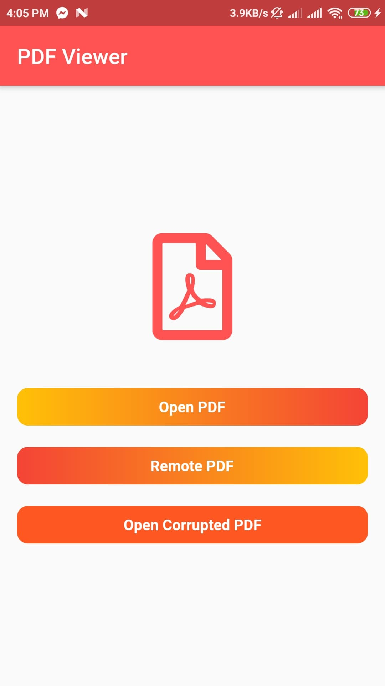
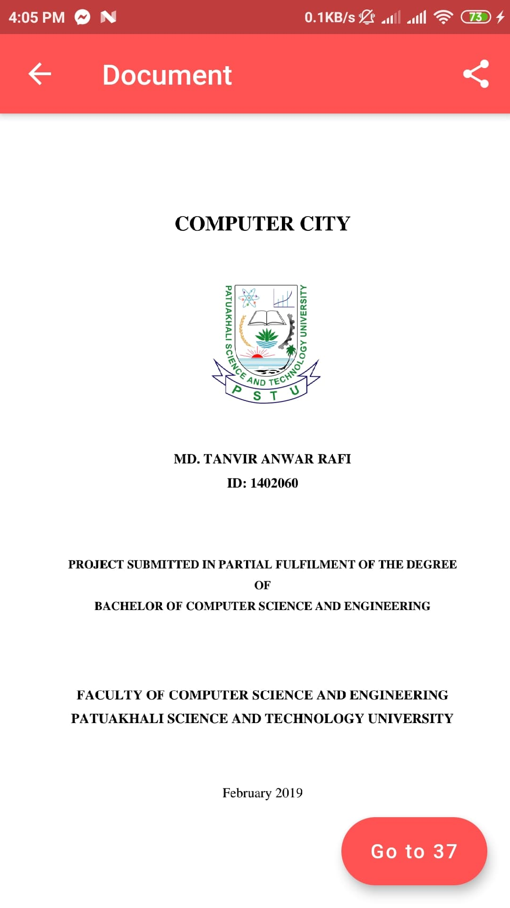
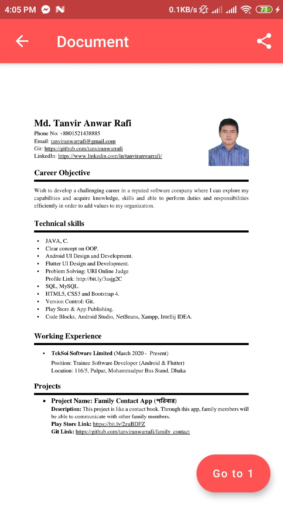

# PDFViewer Flutter

This project is for learning how to use pdfviewer widget in Flutter App.

### PDFView Package

```dart
dependencies:
  flutter_pdfview: ^1.0.0+10
```

```dart
$ flutter packages get
```

```dart
import 'package:flutter_pdfview/flutter_pdfview.dart';
```

```dart
 PDFView(
   filePath: path,
   enableSwipe: true,
   swipeHorizontal: true,
   autoSpacing: false,
   pageFling: false,
   onRender: (_pages) {
     setState(() {
       pages = _pages;
       isReady = true;
     });
   },
   onError: (error) {
     print(error.toString());
   },
   onPageError: (page, error) {
     print('$page: ${error.toString()}');
   },
   onViewCreated: (PDFViewController pdfViewController) {
     _controller.complete(pdfViewController);
   },
   onPageChanged: (int page, int total) {
     print('page change: $page/$total');
   },
 ),
```

## Screenshots
 &nbsp;&nbsp;&nbsp;&nbsp;&nbsp;&nbsp;&nbsp;&nbsp;&nbsp;&nbsp; &nbsp;&nbsp;&nbsp;&nbsp;&nbsp;&nbsp;&nbsp;&nbsp;&nbsp;&nbsp; 
