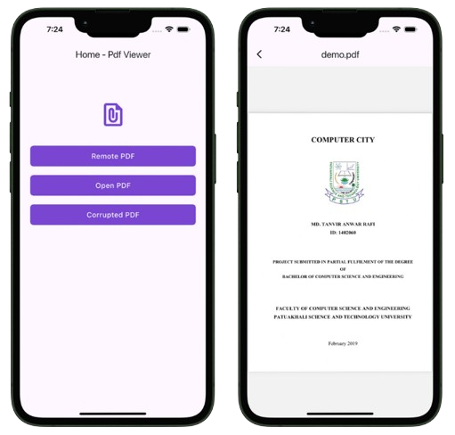

# Pdf Viewer
This project is for learning how to use pdfviewe widget in Flutter App.

### Load Asset Pdf
```dart
Future<File?> _pdfFromAsset(String asset, String filename) async {
  Completer<File> completer = Completer();
  try {
    var dir = await getApplicationDocumentsDirectory();
    File file = File('${dir.path}/$filename');
    var data = await rootBundle.load(asset);
    var bytes = data.buffer.asUint8List();
    await file.writeAsBytes(bytes, flush: true);
    completer.complete(file);
    return completer.future;
  } catch (e) {
    throw Exception('Error parsing asset file!');
  }
}
```

### Load Network Pdf
```dart
Future<File?> _pdfFromNetworkUrl() async {
  Completer<File> completer = Completer();
  try {
    var filename = URL_3.substring(URL_3.lastIndexOf('/') + 1);
    var request = await HttpClient().getUrl(Uri.parse(URL_3));
    var response = await request.close();
    var bytes = await consolidateHttpClientResponseBytes(response);
    var dir = await getApplicationDocumentsDirectory();
    if (kDebugMode) print('${dir.path}/$filename');
    File file = File('${dir.path}/$filename');
    await file.writeAsBytes(bytes, flush: true);
    completer.complete(file);
    return completer.future;
  } catch (e) {
    throw Exception('Error parsing asset file!');
  }
}
```

### Load Pages
```dart
PDFPage pageOne = await doc.get(page: _number);
```
### Screenshots
 
